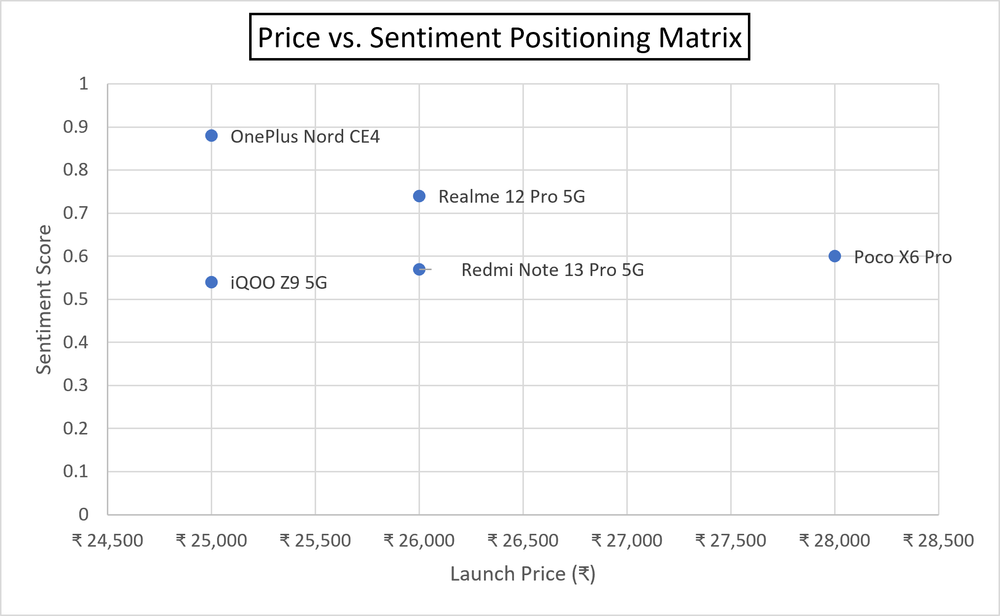
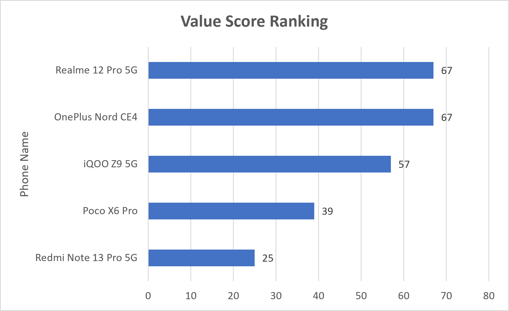

# OnePlus Nord CE4 Launch: A Retrospective Market Analysis

A data-driven look at how the OnePlus Nord CE4 performed against four direct competitors at launch (2024) — combining specs, pricing, formal e-commerce reviews, brand marketing angles, and informal community sentiment into one comparative dataset.

## Overview

When the OnePlus Nord CE4 launched in April 2024, it entered a crowded ₹24,000–28,000 mid-range segment against the Redmi Note 13 Pro 5G, Realme 12 Pro 5G, iQOO Z9 5G, and Poco X6 Pro. This project asks a simple question: **did the Nord CE4's launch positioning actually match how the market received it?**

Rather than relying on a single pre-made dataset, this project builds its own by manually collecting and combining data from four different types of sources — a deliberate choice to practice real-world data integration, not just analysis on a clean CSV.

## Objective

- Compare the OnePlus Nord CE4 against its closest launch-window competitors on specs, price, and reception
- Check whether formal e-commerce ratings and informal community sentiment (Reddit/YouTube-style discussion) tell the same story
- Identify which phone offered the strongest overall value proposition at launch
- Test whether a brand's marketing angle held up against how customers actually talked about the product

## Data Sources & Methodology

Data was collected across four categories and combined into a single master comparison table using "Phone Name" as the join key.

| Tab | Source Type | What It Contains |
|---|---|---|
| Specs & Pricing | Official brand sites, GSMArena, 91mobiles | Launch price, processor, display, camera, battery, launch date |
| Reviews & Sentiment | Flipkart / Amazon.in listings | Individual customer star ratings and review text |
| News & Positioning | Gadgets360, TimesNow, CNBC-TV18, 91mobiles launch articles | Each brand's stated marketing angle at launch, with source article links |
| Informal Sentiment | Reddit / YouTube comment themes | Recurring positive/negative themes and their approximate frequency |

**A note on rigor:** review and informal sentiment samples are small (7–11 data points per phone) and hand-collected rather than scraped at scale. Findings here are directional and illustrative of a methodology, not statistically representative of the full market. This is intentional — the project prioritizes demonstrating a real data-collection and synthesis workflow over dataset size.

## Tools Used

- Google Sheets / Excel for data collection, cleaning, and formula-based aggregation (`AVERAGEIF`, `SUMIFS`, `CORREL`)
- Chart-based visualization (scatter plot, horizontal bar chart) for comparative analysis

## Key Findings

### 1. Price and reception move in different directions depending on the source

| Metric | Correlation with price |
|---|---|
| Formal e-commerce rating | +0.57 (weak–moderate positive) |
| Informal community sentiment | −0.32 (weak negative) |

Phones priced higher in this set tended to score slightly *better* on formal star ratings, but slightly *worse* on informal community sentiment. This divergence is the most interesting result in the dataset — it suggests formal ratings may skew positive from post-purchase justification bias, while informal discussion is more price-conscious and critical.



The OnePlus Nord CE4 sits in the strongest quadrant: lowest price tier, highest informal sentiment (88%). The iQOO Z9 5G, at the same price point, has the lowest sentiment (54%) — despite similar positioning, the market received it very differently.

### 2. Value score ranking

A composite score combining normalized price, formal rating, and sentiment score (equal weighting, 0–100 scale) ranks the five phones as follows:



**Realme 12 Pro 5G and OnePlus Nord CE4 tie for best overall value** (67/100), while the **Redmi Note 13 Pro 5G ranks lowest** (25/100) despite its headline 200MP camera — a reminder that a strong spec sheet doesn't guarantee strong reception.

### 3. Marketing angle vs. actual reception

| Phone | Marketing Angle | Did It Hold Up? |
|---|---|---|
| OnePlus Nord CE4 | Fastest charging in Nord history | Yes — informal sentiment strongly praised battery/charging |
| Redmi Note 13 Pro 5G | Flagship 200MP camera at mid-range price | Partially — camera praised, but software/heating complaints dragged sentiment down |
| Realme 12 Pro 5G | Telephoto portrait camera system | Yes — camera and design consistently praised |
| iQOO Z9 5G | Gaming-grade chip at budget price | Partially — gaming performance praised, but software complaints were the most frequent negative theme |
| Poco X6 Pro | Flagship performance, mid-range price | Partially — strongest gaming performance claims, but heating and thermal complaints were the dominant negative theme |

## Conclusion

The OnePlus Nord CE4's "fastest charging" positioning was narrow but effective — it converted directly into the strongest informal sentiment in the segment, at the lowest price point. Competitors with flashier spec-sheet claims (200MP camera, flagship chipsets) generated more mixed reception once real usage issues (software, heating) entered the conversation. For a mid-range launch, a focused, deliverable promise appears to have outperformed a broader "does everything" pitch.

## Repository Structure

```
├── README.md
├── data/
│   └── nord_ce4_market_analysis.xlsx   (all 4 tabs + master summary)
├── charts/
│   ├── price_vs_sentiment_positioning.png
│   └── value_score_ranking.png
```

## Limitations & Future Work

- Sample sizes for reviews and informal sentiment are small and manually collected; a scraped dataset (hundreds of reviews per phone) would strengthen statistical confidence
- Only five competitors were compared; a wider competitive set could shift the value ranking
- This analysis is retrospective — a natural next step would be a predictive model estimating launch reception from specs and pricing alone, tackled separately as a dedicated machine learning project given the small sample size here

---

*This project was built as a self-directed learning exercise in data collection, aggregation, and market analysis methodology.*
